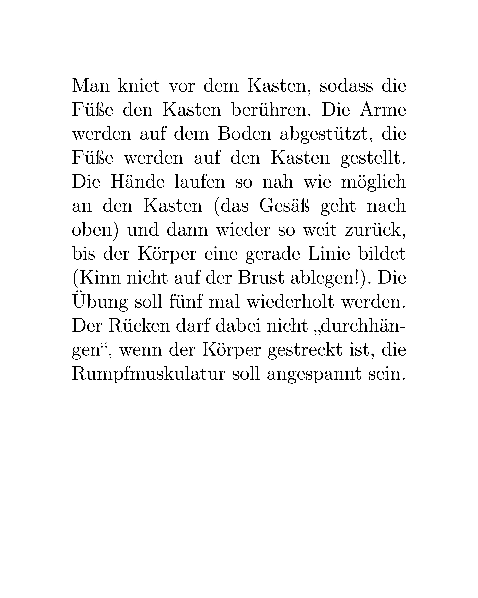
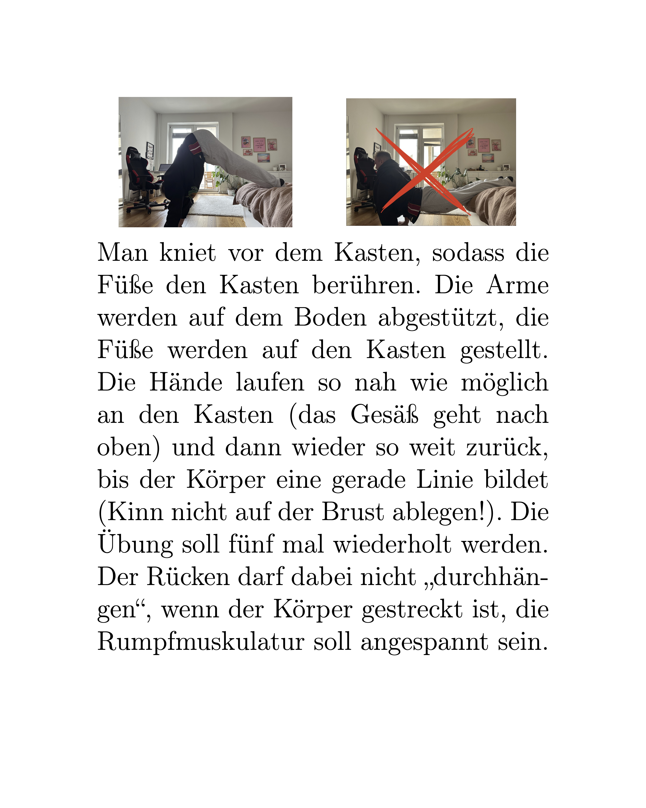
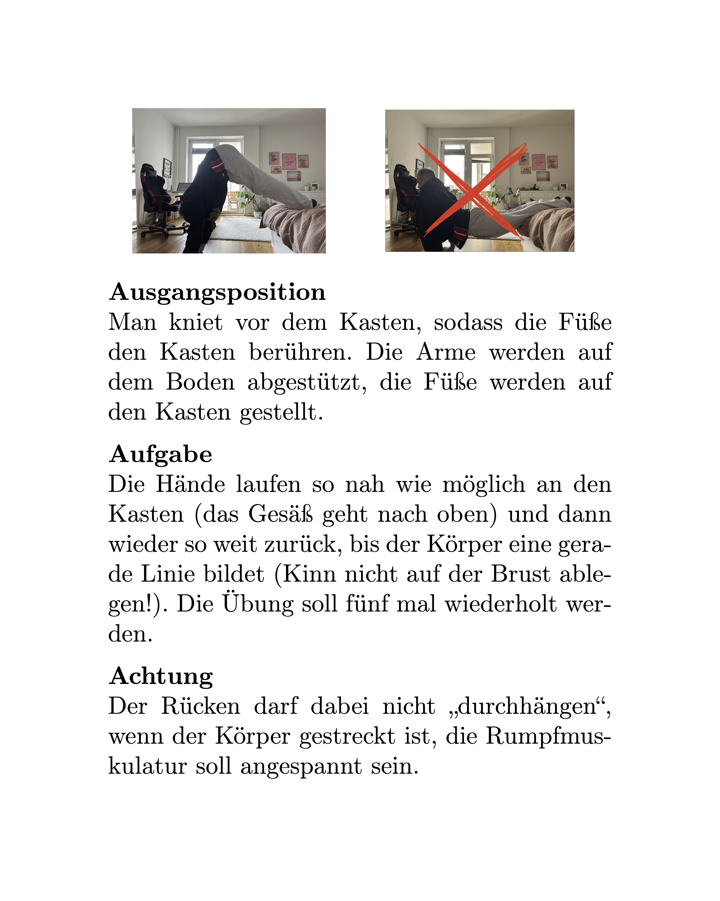

<!--
author: Jannis Eckelt
email: jannis.eckelt@studierende.uni-flensburg.de
version: 0.0.1
language: de
narrator: Deutsch Female

import:  https://raw.githubusercontent.com/Just-Jannis/Barrierefreie-Lernmaterialien/refs/heads/main/config.md

-->

# Lernmaterialien in Bewegung, Spiel und Sport

| Parameter                | Kursinformationen                                                                               |
| ------------------------ | ----------------------------------------------------------------------------------------------- |
| **Veranstaltung:**       | @config.lecture                                                                                 |
| **Semester:**            | @config.semester                                                                                |
| **Hochschule:**          | `Europa-Universität Flensburg`                                                                  |
| **Inhalte:**             | `Motivation der Vorlesung und Beschreibung der Organisation der Veranstaltung`                  |
| **Link auf GitHub:**     | https://github.com/Just-Jannis/Barrierefreie-Lernmaterialien/blob/main/barrierefreieMaterialien.md    |
| **Autoren:**             | @author                                                                                         |

> (c) Alle Rechte vorbehalten. 

Wir als Sportlehrkräfte haben ein Interesse dran, gutes Lernmaterial für unsere Schüler:innen zu erstellen. Warum? Weil gutes Lernmaterial den Schüler:innen ermöglicht, sich noch selbstständiger und eigenverantwortlich mit neuen Lerngegenständen auseinanderzusetzen. Außerdem schafft gelungenes Lernmaterial Vielfalt im Sportunterricht, da es ermöglicht, dass auch Kinder und Jugendliche mit unterschiedlichen Vorraussetzungen an Sport und Bewegung teilhaben können. Derartige Materialien bieten aber nicht nur Vorteile für die Schüler:innen, sondern können zusätzlich die Lehrkräfte entlasten, da diese nicht jede Aufgabe formulieren, Gruppen organisieren oder Hinweise geben muss. Stattdessen übernimmt das Material selbst bereits einen großen Anteil dieser Aufgaben.

Es stellt sich daher nun zurecht die Frage, welche Kennzeichen es für gelungene Lernmaterialien gibt. Dieser Frage möchten wir nun nachgehen.

## Kennzeichen für gelungenes Lernmaterial
Gelungenes Lernmaterial zeichnet sich durch die Berücksichtigung der folgenden fachübergreifenden Prinzipien aus: Multimediaprinzip, Segmentierungsprinzip, Kontinguitätsprinzip, Signalisierungsprinzip, Personalisierungsprinzip und Antropomorphisierungsprinzip. Diese Prinzipien wurden überwiegend von Experimenten abgeleitet, in denen zwei verschiedene Lerngruppen mit jeweils verschieden gestalteten Lernmaterialien ausgestattet wurden. Dabei wurde festgestellt, dass die Gruppen am erfolgreichsten lernen konnten, deren Lernmaterial die oben genannten Prinzipien berücksichtigt hat. Was diese Prinzipien im Einzelnen bedeuten, dass wollen wir uns jetzt Schritt für Schritt anschauen und anhand eines Beispiels druchgehen.

~~**Beispiel:**~~
Stellen wir uns vor wir führen mit der Klasse einen Kraftzirkel durch, bei dem die Schüler:innen an mehreren Stationen verschiedene Übungen durchführen sollen. Wir als Lehrkraft möchten nun Stationskarten entwerfen, damit die Schüler:innen an den Stationen selbstständig arbeiten können. Wir beginnen, indem wir lediglich die auszuführende Übung mit worten beschreiben. Dies könnte beispielsweise folgendermaßen aussehen:

Ob alle Schüler:innen mit dieser Art der Stationskarten jedoch zurechtkommen würden ist fragwürdig. Tatsächlich ist hier nicht eins der oben genannten Prinzipien erfüllt. Wir gehen daher nun die besagten Prinzipien durch und passen dabei unsere entworfene Stationskarte stetig an, um auf diese Weise gelungenes Lernmaterial zu erhalten.

### Multimediaprinzip 🖼️
Aktuell Haben wir auf unserer Stationskarte lediglich Text, in dem die durchzuführende Übung beschrieben wird. Schüler:innen, die möglicherweise keinen ausgeprägten sportlichen Hintergrund haben, könnten Schwierigkeiten bei der Umsetzung haben. Aber auch eine Lese-Rechtschreib-Schwäche (LRS) könnte es den betroffenen Kindern und Jugendlichen erschwerern, den Arbeitsauftrag zu verstehen. Um unsere Stationskarte dahingehend zu verbessern, sollten wir das Multimediaprinzip berücksichtigen. Dieses besagt, dass die Schüler:innen besser lernen können, wenn mehr als eine Darstellungsform angeboten wird (Fletcher & Tobias, 2005). In unserem Fall haben wir lediglich Text als Darstellungsform. Wir könnten diese z.B. durch Bilder, die die Durchführung der Übung zeigen, ergänzen und so eine Kombination von mehereren Darstellungsformen (Text + Bild) erzeugen. Dies könnte bspw. folgendermaßen aussehen:

  
  

    
    
Nur Text

  

  
➡️

  

    
    
Text + Bild

  

### Segmentierungsprinzip
Aktuell besteht unsere Stationskarte aus einer Kombination aus Text und begleitenden Bildern, welche die Übungen zeigen. Die Bilder allein reichen jedoch nicht aus, um die Übung vollständig zu verstehen. Das Lesen des Textes ist also immernoch essentiell für die Bearbeitung. Hier findet nun das zweite Prinzip, das Segmentierungsprinzip, Anwendung, denn für einen verbesserten Lerneffekt sollten die Informationen in leicht verständliche Absschnitte unterteilt werden (Rey et al., 2018). Noch misst unser Text jegliche Form der Unterteilung in sinvolle Abschnitte. Eine denkbare Unterteilung wäre "Ausgangspoition -> Aufgabe -> Hinweis auf mögliche Falschausfürhung". Auf diese Weise könnten sich die Schüler:innen gewissermaßen an den einzelnen Punkten "entlang hangeln" um die Übung durchzuführen. Die Unterteilung könnte folgendermaßen aussehen:

  
  

    
    
Ohne Segmentierung

  

  
➡️

  

    
    
Mit Segmentierung

  

### Kontinguitätsprinzip

im Aufbau

### Signalisierungsprinzip

im Aufbau

### Personalisierungsprinzip

im Aufbau

### Antropomorphisierungsprinzip

im Aufbau